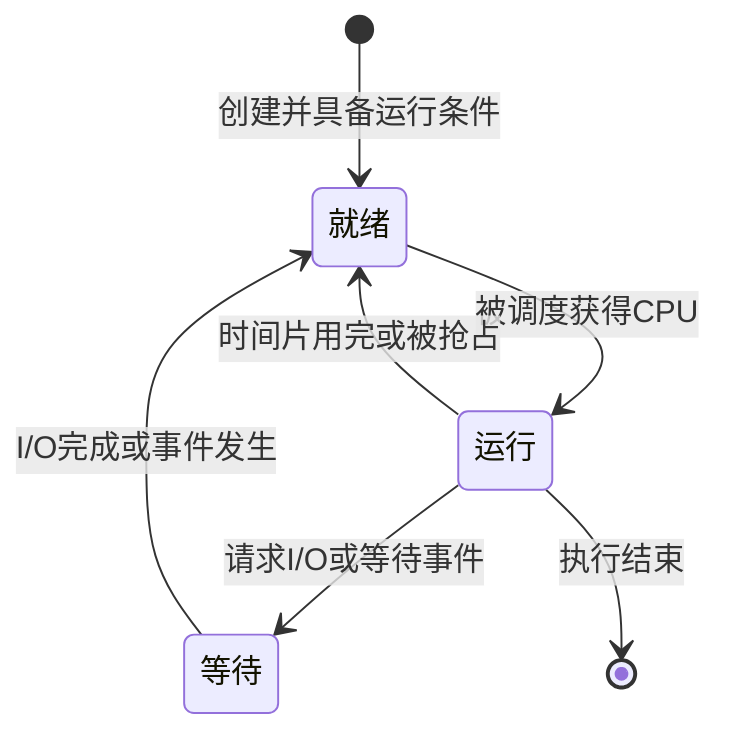

# Day 03：计算机系统——硬件、存储、I/O 与操作系统

日期：2026-08-13  
对应新版教程：第 3 章“计算机系统”  
对应旧题分类：计算机组成与体系结构、操作系统、系统配置与性能评价  
建议用时：闭卷回忆 10 分钟，新课 45 分钟，例题与计算 30 分钟，作业 35—50 分钟  
下次复习：2026-08-14；Day 02 边界专题复习：2026-08-15

## 一、今天的学习目标

完成本课后，你应当能够：

1. 说明 CPU、总线、存储器、I/O 设备和操作系统各自的职责。
2. 使用主频、CPI 和指令数计算 CPU 执行时间。
3. 根据地址位数计算地址空间，根据存储器规格计算芯片数量。
4. 理解存储层次、局部性、Cache 命中率和虚拟存储器。
5. 区分程序查询、中断、DMA 和通道等 I/O 控制方式。
6. 区分进程与线程，判断进程状态转换，并理解死锁产生的必要条件。
7. 在题目中识别 RISC/CISC、常见寻址方式和流水线的基本计算。

今天内容较多，第一次学习不要求把所有细节背熟。优先掌握“部件职责、层次关系、四类 I/O、进程状态”和四个基本计算。

## 二、闭卷回忆：先修复 Day 02 的边界问题

先不要翻答案，口头回答：

1. 以“施工设备安全管理平台软件”为分析对象，线下维修设备属于边界内还是边界外？
2. 工地管理员登录并操作平台，他本人属于软件边界内还是边界外？
3. “维保人员维修设备”为什么不是软件的跨边界数据流？
4. 写出一条包含本平台的跨边界数据流。

答案：

1. 属于边界外；平台只能创建维修任务、跟踪状态和记录结果。
2. 人属于软件边界外的参与者；是否使用界面不能决定是否位于软件内部。
3. 它描述的是现实中的实体活动，没有说明什么数据进入或离开软件。
4. 例如“维保人员 → 维修结果与完成时间 → 本平台”。

继续记住：

> 软件做处理，外部做协作，边界之间传数据。

## 三、计算机系统的整体结构

一个典型计算机系统可以从下到上理解为：

```text
用户与应用软件
        ↓
系统软件：操作系统、驱动程序、语言处理程序等
        ↓
硬件：CPU、主存、总线、I/O 控制器、外部设备
```

操作系统处于应用与硬件之间，负责管理和抽象硬件资源。应用通常不直接操纵磁盘控制器或网卡，而是通过操作系统提供的系统调用使用文件、进程、内存和设备。

### 1. CPU 的组成

CPU 主要包括：

- 运算器：完成算术运算和逻辑运算，核心部件包括算术逻辑单元 ALU。
- 控制器：取出、分析并执行指令，协调各部件工作。
- 寄存器组：暂存指令、地址、操作数和中间结果，速度非常快、容量很小。

常见寄存器及用途：

| 寄存器 | 主要作用 |
|---|---|
| PC，程序计数器 | 保存下一条将要执行的指令地址 |
| IR，指令寄存器 | 保存当前正在执行的指令 |
| MAR，存储器地址寄存器 | 保存将要访问的主存地址 |
| MDR，存储器数据寄存器 | 保存从主存读出或准备写入主存的数据 |
| 通用寄存器 | 保存操作数、地址或中间结果 |

易错点：PC 保存的是“下一条指令的地址”，IR 保存的是“当前指令本身”。

### 2. 总线

总线是多个部件共享的信息传输通路，通常分为：

- 地址总线：传递访问地址，宽度影响可寻址空间。
- 数据总线：传递数据，宽度影响一次能够传输的数据位数。
- 控制总线：传递读写、中断、时钟等控制信号。

地址总线是单向还是双向、数据总线宽度是否等于机器字长，要结合具体体系结构判断；考试中不要把它们机械地视为永远相同。

## 四、CPU 性能的基本计算

### 1. 三个核心量

- 指令数 IC：程序实际执行了多少条指令。
- CPI：平均每条指令需要多少个时钟周期。
- 时钟频率 f：每秒包含多少个时钟周期，即主频。

CPU 执行时间：

> CPU 时间 = 指令数 × CPI × 时钟周期  
> CPU 时间 = 指令数 × CPI ÷ 主频

例如，程序执行 20 亿条指令，平均 CPI 为 1.5，处理器主频为 3 GHz：

> CPU 时间 = 2×10⁹ × 1.5 ÷ 3×10⁹ = 1 秒

主频更高不一定代表运行程序一定更快，因为指令数、CPI、存储访问和 I/O 等也会影响总时间。

### 2. MIPS

MIPS 表示每秒执行多少百万条指令。在指令数和 CPI 统计口径明确时：

> MIPS = 主频（MHz）÷ CPI

但不同指令集的一条指令完成的工作可能不同，因此不能只用 MIPS 跨体系结构判断实际业务性能。

### 3. 常见单位

- 频率：1 GHz = 10³ MHz = 10⁹ Hz。
- 时间：1 秒 = 10³ ms = 10⁶ μs = 10⁹ ns。
- 存储容量：1 KiB = 2¹⁰ B，1 MiB = 2²⁰ B，1 GiB = 2³⁰ B。

题目明确写 KB、MB 并采用十进制时按题意计算；计算地址空间时通常使用 2 的幂。

## 五、数据单位、字长与地址空间

### 1. 位、字节和字长

- bit（位）：二进制信息的最小单位，取值为 0 或 1。
- Byte（字节）：1 B = 8 bit。
- 字：处理器一次自然处理的数据单位。
- 字长：一个字包含的位数，常见为 32 位、64 位，通常影响整数运算能力、寄存器宽度和地址表达能力，但不能简单等同于所有总线宽度。

### 2. 地址空间

若有 n 根地址线，可形成 2ⁿ 个不同地址。容量还取决于每个地址对应的数据单位。

例如，32 位地址、按字节编址：

> 可寻址容量 = 2³² B = 4 GiB

若题目改为“按 4 字节字编址”，同样 32 位地址可以表示 2³² 个字，总字节容量为 2³²×4 B。一定先看编址单位。

### 3. 大端与小端

多字节数据存入连续地址时：

- 大端：高位字节存放在低地址。
- 小端：低位字节存放在低地址。

例如十六进制数 `0x12345678` 从地址 100 开始存放：

| 地址 | 大端 | 小端 |
|---:|---:|---:|
| 100 | 12 | 78 |
| 101 | 34 | 56 |
| 102 | 56 | 34 |
| 103 | 78 | 12 |

端序只改变字节在内存中的排列，不改变这个数本身的逻辑值。

## 六、存储系统

### 1. 存储层次

典型存储层次如下：

| 层次 | 速度 | 容量 | 单位成本 | 是否通常易失 |
|---|---|---|---|---|
| 寄存器 | 最快 | 最小 | 最高 | 是 |
| Cache | 很快 | 很小 | 很高 | 是 |
| 主存 | 中等 | 中等 | 中等 | 是 |
| SSD/磁盘 | 较慢 | 很大 | 较低 | 否 |
| 归档存储 | 最慢 | 可很大 | 最低 | 否 |

设计目标是让程序感受到“接近上层的速度、接近下层的容量和成本”。实现这一目标依赖程序的局部性：

- 时间局部性：刚访问过的数据或指令，很可能很快再次访问。
- 空间局部性：访问某个地址后，很可能访问它附近的地址。

循环变量反复使用体现时间局部性；顺序遍历数组体现空间局部性。

### 2. Cache

Cache 保存近期可能被 CPU 使用的主存数据副本。CPU 请求数据时：

- 命中：在 Cache 中找到。
- 未命中：需要到下一层存储器取数，并可能替换 Cache 中已有内容。

常见映射方式：

| 映射方式 | 一个主存块可放的位置 | 特点 |
|---|---|---|
| 直接映射 | 唯一指定位置 | 简单、快，但冲突可能多 |
| 全相联映射 | 任意位置 | 冲突少，比较和控制成本高 |
| 组相联映射 | 指定组内的任意位置 | 在冲突率与成本之间折中 |

### 3. 平均访问时间

若 Cache 命中率为 H，Cache 访问时间为 Tc，主存访问时间为 Tm，并且未命中时先查 Cache 再访问主存，则：

> 平均访问时间 = H×Tc + (1-H)×(Tc+Tm)

例如 H=95%，Tc=10 ns，Tm=100 ns：

> 0.95×10 + 0.05×(10+100) = 15 ns

有些教材或题目把 Tm 定义为“未命中后的总耗时”，此时会写成 `H×Tc+(1-H)×Tm`。做题前必须看清时间是否已经包含 Cache 查询，不能只背一个公式。

### 4. 存储器芯片扩展

芯片规格通常写成“字数×每字位数”，例如 `2K×8 位`。

要用 `2K×8 位` 芯片组成 `8K×16 位` 存储器：

- 字方向扩展：8K÷2K=4 组。
- 位方向扩展：16÷8=2 片并联。
- 总芯片数：4×2=8 片。

口诀：

> 先做字扩展，再做位扩展，两者相乘。

## 七、输入输出控制方式

CPU 与慢速外设之间速度差异很大，需要合适的 I/O 控制方式。

| 方式 | 工作特点 | CPU 负担 | 适用理解 |
|---|---|---:|---|
| 程序查询 | CPU 反复检查设备状态，设备就绪后传输 | 最大 | CPU 忙等，实现简单 |
| 中断 | 设备就绪后通知 CPU，CPU 暂停当前程序处理 | 较小 | 避免持续轮询，适合低中速、非连续事件 |
| DMA | DMA 控制器在主存与设备之间成块传输，完成后通知 CPU | 很小 | 适合磁盘、网卡等高速批量传输 |
| 通道或 I/O 处理机 | 专门处理更复杂的 I/O 程序和多设备管理 | 最小 | 大型系统中进一步减轻 CPU 负担 |

### 中断并不等于进程一定结束

发生中断时，处理器通常保存当前现场，转去执行中断服务程序，完成后再恢复或重新调度。中断是硬件和操作系统协作处理异步事件的机制。

### DMA 的关键边界

DMA 不是“完全不需要 CPU”：CPU 仍要设置传输参数、启动 DMA，并处理完成中断；只是批量数据传输过程主要不由 CPU 逐字节搬运。

## 八、指令系统、寻址与流水线

### 1. 指令的基本组成

一条机器指令通常包含：

- 操作码：说明执行什么操作，如加、减、读、写、跳转。
- 地址码或操作数字段：说明操作数在哪里，或如何得到操作数。

### 2. 常见寻址方式

| 寻址方式 | 操作数在哪里 | 识别特点 |
|---|---|---|
| 立即寻址 | 指令中直接给出操作数 | 取数快，常数范围受指令长度限制 |
| 直接寻址 | 指令地址字段直接给出内存地址 | 还需访问一次内存取操作数 |
| 间接寻址 | 地址字段指向的单元中再保存有效地址 | 寻址灵活，访存次数更多 |
| 寄存器寻址 | 操作数位于寄存器 | 速度快，寄存器数量有限 |
| 变址寻址 | 形式地址与变址寄存器内容相加 | 常用于数组和循环 |
| 基址寻址 | 位移量与基址寄存器内容相加 | 常用于程序重定位和地址空间管理 |

### 3. RISC 与 CISC

| 比较项 | RISC | CISC |
|---|---|---|
| 指令集 | 指令较少、功能较规整 | 指令较多、功能复杂 |
| 指令长度 | 通常较固定 | 可变长度较常见 |
| 寻址方式 | 较少 | 较多 |
| 访存方式 | 常采用 Load/Store 思想 | 复杂指令可直接操作内存 |
| 控制实现 | 较适合硬布线和流水线 | 传统上较多采用微程序控制 |

这些是典型倾向，不要把它们当成所有现代处理器都严格满足的绝对规则。

### 4. 流水线

流水线把一条指令分成若干阶段，使多条指令的不同阶段重叠执行。

假设有 k 个阶段，每阶段耗时均为 Δt，连续执行 n 条指令，忽略停顿：

> 非流水时间 = n×k×Δt  
> 流水时间 = (k+n-1)×Δt

例如 4 级流水线，每级 2 ns，连续执行 100 条指令：

> 流水时间 = (4+100-1)×2 = 206 ns

现实中还存在结构冲突、数据相关和分支等控制相关，可能造成流水线停顿，因此实际加速比通常低于理想值。

## 九、操作系统核心知识

操作系统的主要职责包括处理器管理、存储管理、设备管理、文件管理，以及向应用提供统一接口。

### 1. 进程与线程

- 进程：正在执行的程序实例，是资源分配和保护的基本单位之一，拥有独立地址空间等资源。
- 线程：进程中的执行单元。同一进程内的线程通常共享代码、数据和打开的文件，但具有各自的栈、寄存器状态和程序计数器。

线程切换和通信通常比进程更轻量，但共享数据也会带来竞态条件，需要同步控制。

### 2. 进程的基本状态



易错点：等待状态的进程在事件完成后通常先进入就绪状态，不能直接宣称它一定立即运行，因为还要等待调度器分配 CPU。

### 3. 调度算法

- 先来先服务 FCFS：简单，但长作业可能让短作业等待很久。
- 短作业优先 SJF：平均等待时间可能较短，但长作业可能饥饿，且实际运行时间不易精确预知。
- 优先级调度：高优先级先运行，低优先级可能饥饿，可用动态优先级或老化缓解。
- 时间片轮转 RR：每个就绪进程轮流获得时间片，适合分时交互系统；时间片太小会增加切换开销，太大则接近 FCFS。

### 4. 同步、互斥与死锁

- 互斥：同一时间只允许一个执行单元进入临界区访问共享资源。
- 同步：多个执行单元按一定次序或条件协作。
- 信号量：可用于表达互斥和同步，但使用错误也可能产生死锁。

死锁产生的四个必要条件：

1. 互斥：资源不能被多个进程同时使用。
2. 请求并保持：进程占有部分资源时继续等待其他资源。
3. 不可剥夺：已分配资源不能被系统强行收回，只能由占有者释放。
4. 循环等待：多个进程形成首尾相接的资源等待环。

四个条件同时成立才可能产生死锁。破坏其中任何一个，可以从机制上预防死锁。

### 5. 内存管理

| 方式 | 基本单位 | 优点 | 典型问题 |
|---|---|---|---|
| 分页 | 固定大小的页和页框 | 无外部碎片，便于离散分配 | 可能有页内碎片，需页表转换 |
| 分段 | 按代码、数据、栈等逻辑段划分，长度可变 | 符合程序逻辑，便于共享保护 | 容易产生外部碎片 |
| 段页式 | 先分段，再对段分页 | 综合两者优点 | 地址转换与管理更复杂 |

虚拟存储器允许程序的部分页面暂时不在主存，需要时再调入。若访问的页不在主存，会产生缺页中断。虚拟内存扩大的是程序可使用的逻辑地址空间，并不会凭空提高物理内存速度；频繁缺页还可能引发抖动。

TLB 是页表项的高速缓存，用于加速虚拟地址到物理地址的转换；它与保存普通数据块的 Cache 用途不同。

## 十、从系统分析师视角理解计算机系统

系统分析师不必亲自设计 CPU，但必须知道底层机制怎样影响系统方案和非功能需求。

以“设备传感器数据采集”为例：

| 层次 | 可能承担的职责 |
|---|---|
| 设备和传感器 | 产生载荷、运行时长和异常信号 |
| I/O 控制器与驱动 | 接收设备数据，处理中断或 DMA 传输 |
| 操作系统 | 调度进程、分配内存、管理设备和网络缓冲区 |
| 物联网平台 | 汇聚设备协议、缓存或转发遥测数据 |
| 安全管理应用 | 保存业务数据、判断告警、展示状态和跟踪处置 |

这也再次说明系统边界：如果分析对象是“安全管理应用软件”，驱动、操作系统、传感器和物联网平台都属于它依赖的外部环境；如果分析对象是“完整设备安全监测系统”，其中一部分又可能被纳入系统内部。

选择硬件和操作系统方案时，应从业务负载、实时性、可靠性、安全性、兼容性、生态、运维能力和成本综合权衡。对于国产操作系统等平台，考试或实际项目都应关注体系结构支持、软硬件兼容、迁移成本和维护生态，不应只背产品名称。

## 十一、例题与完整推导

### 例题 1：CPU 执行时间

某程序执行 12 亿条指令，平均 CPI 为 2，处理器主频为 2.4 GHz，忽略其他等待时间。CPU 执行时间是多少？

> 12×10⁸ × 2 ÷ 2.4×10⁹ = 1 秒

识别信号：题目同时给出指令数、CPI 和主频，直接使用 `IC×CPI÷主频`。

### 例题 2：地址空间

某系统有 24 根地址线，按字节编址，其最大可寻址空间是多少？

> 2²⁴ B = 16 MiB

易错点：不要看到 24 位就除以 8；地址位数决定地址数量，只有数据容量单位换算时才使用 8 bit=1 B。

### 例题 3：存储芯片

用 `2K×8 位` 芯片组成 `8K×16 位` 存储器，需要多少片？

> 字扩展 8K÷2K=4；位扩展 16÷8=2；共 4×2=8 片。

### 例题 4：I/O 方式

高速磁盘需要把大块数据直接传入主存，并尽量减少 CPU 逐字搬运。宜采用哪种方式？

**答案：DMA。**CPU 设置传输参数并启动 DMA，DMA 控制器完成成块传输，结束后再通知 CPU。

### 例题 5：进程状态

某进程因等待磁盘读取而处于等待状态。磁盘中断表明读取完成后，该进程通常先进入什么状态？

**答案：就绪状态。**它已经具备运行条件，但是否立即运行还取决于调度。

### 例题 6：流水线

一条指令分为 5 个阶段，每阶段 2 ns。理想流水方式执行 20 条指令需要多久？

> (5+20-1)×2 = 48 ns

非流水执行需要 `20×5×2=200 ns`。流水线提高的是一批指令的吞吐率，单条指令从进入到完成的理想延迟仍为 10 ns。

## 十二、答题方法与错因标签

### 1. 计算题四步

1. 圈出单位和编址方式。
2. 写出公式，再代数值。
3. 统一 Hz、秒、字节等单位。
4. 用数量级检查答案是否合理。

### 2. 选择题识别词

- “CPU 反复检查设备”→ 程序查询。
- “设备就绪后通知 CPU”→ 中断。
- “设备与主存成块直接传输”→ DMA。
- “事件完成，等待进程……”→ 先进入就绪。
- “下一条指令地址”→ PC。
- “高位字节放低地址”→ 大端。
- “数组下标、循环”→ 常见为变址寻址。
- “地址转换的页表项缓存”→ TLB。

### 3. 错因标签

完成作业和在线题库后，为每道错题标一个主要原因：

- `K`：知识点不会。
- `C`：概念混淆，如把中断和 DMA 混淆。
- `R`：审题或计算推理错误，如漏看“按字节编址”。
- `E`：会知识但表达没有命中得分点。
- `T`：时间管理问题。
- `V`：题目版本或标准可能过时，需要复核。

## 十三、今天的方法总结

今天先建立五条主线：

1. CPU：取指、分析、执行；性能看指令数、CPI 和主频。
2. 存储：越靠上越快、越小、越贵；Cache 利用局部性。
3. I/O：查询最占 CPU，中断按事件通知，DMA 负责成块传输。
4. 指令：寻址决定操作数怎么找，流水线提高吞吐率。
5. 操作系统：管理处理器、内存、设备和文件；等待事件完成后先进就绪队列。

计算口诀：

> CPU 时间看 IC、CPI、主频；地址容量看地址数乘编址单位；存储芯片看字扩展乘位扩展；流水时间看阶段数加指令数减一。

## 十四、课后作业与在线加练

请完成 [`../homework/Day-03-作业答题.md`](../homework/Day-03-作业答题.md)。本次作业包含 10 道综合知识题、3 组微计算、1 个操作系统小案例和 Day 02 边界订正。

完成本仓库作业后，进入[软考达人在线题库](https://ruankaodaren.com/exam/#/)，完成新版第三章“计算机系统”练习。全章约 25 题，可今天做 12 题、次日做 13 题。在线题库不计入本次作业分数，但必须回填题数、正确率、错题考点、错因标签和用时。
