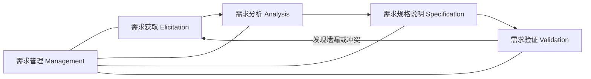
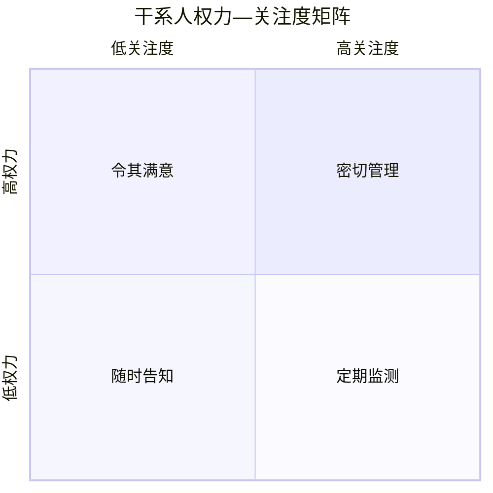

# Day 05：需求获取与干系人分析

学习日期：2026-08-20  
对应新版教程：第 11 章“软件需求工程”  
对应旧题分类：需求工程、需求获取、干系人分析  
建议用时：Day 04 订正 15 分钟，新课 70 分钟，例题与案例 30 分钟，作业 45—60 分钟  
下次复习：2026-08-21；Day 04 错题二刷：2026-08-21

## 一、今天的学习目标

完成本课后，你应当能够：

1. 区分需求获取、需求分析、需求规格说明、需求验证和需求管理。
2. 识别直接用户、间接用户、管理者、运维、合规部门和外部合作方等干系人。
3. 使用权力—关注度矩阵制定不同的参与和沟通策略。
4. 根据需求类型选择访谈、观察、问卷、文档分析、原型、工作坊等获取方法。
5. 编写不诱导答案、能够追问异常流程和验收标准的访谈问题。
6. 区分干系人的原始陈述、业务规则、需求、假设、约束和候选方案。
7. 记录需求来源、冲突、未决问题和确认结果，为后续追踪与变更管理保留依据。

今天的核心不是“问用户想要什么功能”，而是：

> 找对人，用合适的方法获得证据，把真实工作、隐性规则、异常情况和质量期望问出来。

## 二、课前订正：修复 Day 04 的三个漏洞

### 1. 加权评分先核对原始数据

Day 04 中项目 C 的战略匹配度是 4，不是 3：

> 项目 C = `4×0.35+4×0.30+5×0.20+4×0.15=4.20`

所以单按该模型应优先选择项目 C，而不是项目 A。以后固定执行：

1. 逐项从原表横向抄数；
2. 计算后比较全部候选项目；
3. 再检查法律、预算和资源等一票否决条件。

### 2. Cache 先画命中与未命中两条路径

题目给出 Cache 8 ns、主存 72 ns、命中率 75%，并说明未命中时先查 Cache：

- 命中路径：8 ns；
- 未命中路径：`8+72=80 ns`；
- 平均时间：`0.75×8+0.25×80=26 ns`。

不要直接把 8 和 72 加权，因为 72 ns 只表示未命中后访问主存的时间。

### 3. 假设、风险、约束和问题

| 类型 | 判断信号 | 示例 |
|---|---|---|
| 假设 | 暂时认为成立，后续需验证 | 假设旧系统可以导出完整客户编号 |
| 风险 | 未来可能发生并影响目标 | 数据清洗可能导致延期 |
| 约束 | 已确定并限制方案选择 | 一期必须在五个月内上线 |
| 问题 | 已经发生或已经确认的事实 | 20% 历史记录缺少客户编号 |

今天在访谈中也要区分这四类内容。干系人说“应该没问题”时，不能直接把它写成已确认需求，应记录为假设或待办问题并安排验证。

## 三、需求工程处在什么位置

需求工程通常包括以下相互迭代的活动：

- 需求获取：从人员、流程、文档、现有系统和运行数据中发现需求。
- 需求分析：分类、建模、澄清、协商冲突并检查可行性。
- 需求规格说明：用结构化文字或模型记录已经明确的需求。
- 需求验证：检查需求是否正确、完整、一致、可行和可验证。
- 需求管理：维护基线、版本、优先级、追踪关系和变更。

这些活动不是严格的一次性流水线。原型可能让用户发现遗漏，验证也可能要求重新访谈。

易错点：需求获取不是让用户独自写完一份功能清单；需求分析师也不能仅凭自己的经验替用户决定业务规则。

## 四、为什么需求很难“直接问出来”

### 1. 干系人只知道自己的局部

客服熟悉客户投诉，却未必知道财务对退款凭证的要求；管理员知道权限配置，却未必理解门店高峰期的实际操作压力。不同角色看到的是同一系统的不同切面。

### 2. 隐性知识难以表达

熟练员工会跳过已经内化的步骤。例如他说“核对无误就提交”，但没有主动说明核对哪些字段、允许多大差异、谁有权处理例外。这些没有写下来的经验属于隐性知识。

### 3. 陈述可能是方案，不是问题

用户提出“必须加一个红色大屏”，背后可能真正需要的是：异常发生后值班经理能在一分钟内识别并处理。分析师应追问目标和使用场景，而不是直接把界面方案当作最终需求。

### 4. 不同角色的目标可能冲突

- 门店希望少录入，财务希望每笔调整都有完整凭证。
- 安全部门希望严格认证，现场人员希望快速操作。
- 管理层希望实时数据，基层人员担心上报工作量。

冲突不是谁“说错了”，而是需要用整体目标、法规、数据和决策权限进行权衡。

### 5. 语言可能含糊

“实时”“方便”“重要客户”“尽快”“大数据量”都不能直接验收。获取阶段要追问定义、适用范围、阈值、例外和数据依据。

## 五、识别干系人与需求来源

### 1. 干系人不等于最终用户

干系人是能够影响系统、受到系统影响，或对系统结果承担责任和利益关系的个人、群体或组织。

常见类别：

| 类别 | 可能关注什么 |
|---|---|
| 直接用户 | 工作步骤、效率、易用性、异常处理 |
| 间接用户或受影响人员 | 通知、报表、职责变化、工作量变化 |
| 业务负责人 | 业务目标、范围、规则和验收结果 |
| 管理层或项目发起人 | 战略价值、投资、进度和风险 |
| 运维与支持人员 | 部署、监控、备份、故障和支持责任 |
| 安全、法务、审计、监管方 | 权限、隐私、留痕、保留期限和合规 |
| 数据所有者 | 数据定义、质量、授权和主数据来源 |
| 外部合作方 | 接口、服务水平、责任边界和合同限制 |
| 建设与测试团队 | 技术可行性、可测试性、依赖和交付成本 |

同一人可以拥有多个角色。例如门店经理既是库存查询用户，也可能是库存数据质量责任人。

### 2. 用户是外部参与者，但仍是重要干系人

以“库存协同平台软件”为分析对象时，店长位于软件边界外；但店长是关键用户和干系人，需要参与需求获取。系统边界回答“谁负责处理”，干系人分析回答“谁影响系统或受到系统影响”，两者不是一回事。

### 3. 需求来源不只包括人

除干系人外，需求来源还包括：

- 现行业务流程和岗位制度；
- 表单、台账、合同、报表和审计记录；
- 法律法规、行业标准和公司政策；
- 现有系统界面、数据库、接口和日志；
- 客服工单、错误记录、监控数据和用户行为数据；
- 市场研究、竞品和组织战略；
- 对外合同及第三方平台能力。

外部系统、日志和制度是需求来源，但通常不把一份日志或一台设备称为“干系人”。

### 4. 用清单防止遗漏

针对一个业务事件，从以下方向找人和来源：

> 谁发起 → 谁处理 → 谁审批 → 谁接收结果 → 谁维护数据 → 谁运维 → 谁监管 → 谁付费 → 谁承担失败后果 → 与哪些外部系统协作

以开工审批为例，除工长和安全员外，还应考虑项目经理、企业安全管理部门、审计人员、系统运维、统一认证负责人以及适用的监管规则。

## 六、干系人分析：权力—关注度矩阵

识别之后，还要分析不同干系人的影响力、关注度、诉求、参与方式和决策权限。

| 权力 | 关注度 | 常用策略 | 示例 |
|---|---|---|---|
| 高 | 高 | 密切管理，参与关键规则、范围和验收决策 | 业务负责人、项目发起人 |
| 高 | 低 | 令其满意，关键风险和决策点及时沟通 | 高层主管、监管负责人 |
| 低 | 高 | 随时告知，充分访谈、试用和收集反馈 | 一线用户、客服人员 |
| 低 | 低 | 定期监测，不投入过度沟通成本 | 轻度受影响的外围人员 |

矩阵不是给人员贴永久标签。项目阶段和议题不同，权力与关注度会变化。例如安全部门平时关注度较低，但涉及个人信息方案时拥有很高的决策影响力。

### 干系人分析表

| 干系人 | 目标或关注点 | 影响力 | 关注度 | 掌握的信息 | 参与方式 | 决策权限 |
|---|---|---:|---:|---|---|---|
| 门店店长 | 少增加工作量，及时查库存 | 中 | 高 | 现场流程和异常 | 访谈、观察、试点 | 确认门店流程 |
| 供应链负责人 | 降低缺货和积压 | 高 | 高 | 业务规则与目标 | 工作坊、评审 | 业务范围与规则 |
| 安全法务 | 合法使用个人信息 | 高 | 中 | 合规要求 | 专题访谈、审查 | 合规放行 |
| 运维团队 | 可部署、可监控、易恢复 | 中 | 中 | 运行环境和故障 | 技术访谈、演练 | 运维验收 |

“影响力高”不等于其所有意见自动成为需求。仍需核对目标、证据、法规和责任权限。

## 七、需求获取方法及选型

没有一种方法能覆盖所有需求。通常要组合使用。

### 1. 访谈

适合：深入了解目标、规则、异常、职责、冲突和隐性知识。

优点：可以追问，信息深；缺点：耗时，受访者可能只描述理想流程，访谈者也可能诱导答案。

常见形式：

- 结构化访谈：按固定问题和顺序提问，便于横向比较。
- 半结构化访谈：有提纲，同时允许根据答案深入追问，需求获取中最常用。
- 非结构化访谈：探索性强，但容易遗漏或发散。

### 2. 观察

适合：发现真实操作、隐性步骤、绕行流程、现场限制和人机交互问题。

例如用户说“库存文件每天五分钟就能上报”，现场观察却发现还需手工合并三个表并反复核错。

局限：观察期间行为可能改变；低频异常难以恰好发生；还需注意隐私和安全许可。

### 3. 问卷

适合：用户数量多、地域分散，需要收集标准化意见或频率数据。

优点：覆盖面广、统计方便；缺点：难以追问，问题设计不当会得到表面答案，回收率也可能不高。

问卷适合验证“这个问题在多少门店发生”，不适合单独发现复杂审批规则。

### 4. 文档、接口和现有系统分析

适合：理解现行规则、字段、报表、合同约束、接口能力和历史变化。

要警惕“文档写的流程”与“现场真正执行的流程”不一致，所以通常要结合访谈或观察。

### 5. 抽样

从大量表单、工单、日志和业务记录中选择有代表性的样本，检查正常、峰值、异常和边界情况。

抽样不能只挑容易成功的记录。可以按门店类型、时间段、金额区间、成功失败状态等分层抽取。

### 6. 原型与情节串联板

适合：用户难以用语言表达界面、流程或交互要求，需要通过可视化反馈逐步澄清。

原型用于学习和确认，不代表已经完成产品。需要标明：

- 哪些内容只是假数据或占位；
- 哪些规则尚未实现；
- 性能、安全和异常处理是否在原型范围内；
- 原型是否可丢弃，还是将演化为产品。

否则干系人容易把“页面能点”误认为整个系统已经接近完成。

### 7. 联合需求计划或需求工作坊

把关键业务、用户、技术、运维和合规人员集中起来，在主持人的引导下讨论范围、流程、规则和冲突。

适合跨部门问题和快速协商；风险是高权力人员压制一线用户、会议失控或没有决策人。应提前明确议题、材料、角色和决策规则，并记录未决项与责任人。

### 8. 方法选型表

| 需求情形 | 优先方法 | 配套方法 |
|---|---|---|
| 少数专家掌握复杂规则 | 半结构化访谈 | 文档分析、工作坊 |
| 大量分散用户的共性问题 | 问卷 | 抽样访谈 |
| 用户说不清真实操作 | 现场观察 | 追问、流程建模 |
| 界面与交互难以描述 | 原型或情节串联板 | 可用性测试 |
| 跨部门规则冲突 | 需求工作坊 | 单独访谈、决策记录 |
| 旧系统迁移和接口 | 文档、数据与接口分析 | 原型、抽样验证 |
| 低频但严重的异常 | 工单和日志分析 | 专家访谈、场景推演 |

## 八、怎样设计一次有效访谈

### 1. 访谈前

1. 明确访谈目标：这次要确认业务目标、当前流程，还是异常规则？
2. 选择合适受访者：他是否真正执行或负责这项工作？
3. 阅读已有资料：避免把文档中已有的基础事实全部重新问一遍。
4. 准备提纲和时间安排：从开放问题进入，再逐步追问细节。
5. 说明记录、录音和隐私规则，并取得必要许可。

### 2. 问题结构

一个实用顺序是：

> 目标 → 触发 → 正常流程 → 数据与规则 → 异常 → 角色权限 → 质量 → 约束 → 验收

以库存协同平台为例：

1. 当前库存汇总主要支持哪些业务决策？最严重的问题是什么？
2. 谁在什么时间触发库存上报？上报完成的定义是什么？
3. 请按最近一次真实上报，从开始到结束逐步讲一遍。
4. 哪些字段来自系统，哪些由人工填写？谁对准确性负责？
5. 文件缺字段、重复、迟到或库存为负时，现在如何处理？
6. 谁可以修改已上报库存？修改后需要谁审批和留痕？
7. 高峰期有多少门店同时上报？可以接受多久延迟？数据依据是什么？
8. 哪些信息不得被普通门店查看？记录需保留多久？
9. 五个月一期必须实现什么，哪些内容可以推迟？
10. 上线后用哪些指标证明项目有效？谁确认验收？

### 3. 开放、封闭和追问问题

- 开放问题：“请描述一次库存差异的处理过程。”适合探索。
- 封闭问题：“库存差异超过 5% 是否必须审批？”适合确认明确事实。
- 追问问题：“最近一次是什么时候？谁处理？用了多久？有没有记录？”适合获得证据。

访谈通常从开放问题开始，用追问获得实例，最后用封闭问题确认结论。

### 4. 避免诱导和过早给方案

不佳：

> 使用实时消息队列是不是比每天导文件好得多？

问题：预设了技术答案，也可能让受访者顺着访谈者表态。

更佳：

> 当前库存变化需要多快被总部看到？如果延迟 10 分钟、1 小时或次日，分别会造成什么影响？这个判断有什么历史数据支持？

### 5. 把模糊词追问成可验证内容

| 模糊陈述 | 追问方向 |
|---|---|
| 系统要实时 | 哪类数据？从哪个事件到哪个结果？允许多少秒或分钟？ |
| 操作要方便 | 哪个角色、哪个任务、多少步骤、什么环境？ |
| 重要客户优先 | “重要”的判断规则是什么？谁维护？冲突时怎么办？ |
| 数据必须安全 | 防谁、保护什么、允许谁访问、如何审计？ |
| 报表尽快生成 | 数据规模和高峰条件是什么？允许等待多久？ |

### 6. 用真实实例和反例

不要只问“正常情况下怎么做”，还应问：

- 最近一次失败或返工是什么情况？
- 最复杂的一笔业务是什么？
- 哪些操作必须绕过现有系统？为什么？
- 如果审批人离岗、接口超时、数据重复，会怎样处理？
- 有没有看似不合理但法规或现场必须保留的步骤？

## 九、把访谈内容转化为可用的需求记录

### 1. 不要把原话直接当最终需求

干系人原话：

> 我想要一个按钮，一点就把所有库存同步掉。

拆解后可能得到：

- 业务问题：门店库存更新延迟，人工逐店汇总耗时。
- 用户需求：供应链人员需要发起全部门店的库存汇总并查看失败门店。
- 功能需求：系统应创建一次库存汇总任务，记录每家门店的成功、失败和重试状态。
- 候选非功能需求：95% 的标准接口门店应在任务发起后 10 分钟内完成同步，阈值需确认。
- 未决问题：老门店是否支持自动获取，还是只能上传文件？
- 候选方案：“一个按钮”只是界面方案，需经过交互设计确认。

### 2. 每条记录至少保留来源和状态

| 字段 | 作用 |
|---|---|
| 编号 | 唯一标识，便于引用 |
| 内容 | 原始陈述或整理后的需求 |
| 来源 | 干系人、文档、法规、日志或接口 |
| 理由 | 解决什么问题、支持什么目标 |
| 状态 | 候选、待澄清、已确认、已拒绝等 |
| 优先级 | 业务相对重要性 |
| 假设和依赖 | 需求成立依赖什么条件 |
| 验收方式 | 将来如何证明满足 |

来源追踪很重要。如果两项需求冲突，分析师需要知道谁提出、依据是什么、谁有权决定。

### 3. 访谈纪要要确认

访谈后应尽快：

1. 整理事实、需求、假设、问题、风险和未决项；
2. 标记责任人和完成日期；
3. 把结论发给参与者确认；
4. 对重要规则进行交叉验证，不以单个人的说法为唯一依据；
5. 更新术语表，避免同一词在不同部门含义不同。

“受访者没有回复纪要”不应自动视为所有内容已确认，确认规则需要在项目中预先约定。

## 十、需求冲突与协商

### 1. 先记录冲突，不要偷偷折中

例：

- 门店：希望允许当天随时修改库存，不需要审批。
- 审计：所有已上报库存修改必须审批并保留前后值。

分析师不应自行决定“金额小的就不审批”，而应记录冲突双方、依据、影响和待决策人。

### 2. 用目标和证据协商

可以检查：

1. 是否存在法规或强制政策，先排除不可选方案；
2. 两项诉求分别支持什么业务目标；
3. 每种方案对效率、风险、成本和用户体验的影响；
4. 能否按风险等级、金额或场景分层；
5. 谁拥有最终业务决策权。

例如可形成候选方案：普通差异允许修改但必须留痕，超过阈值的修改需要审批。阈值不能由分析师随意虚构，应由业务和审计共同确认。

### 3. 决策要留痕

至少记录：

- 决策内容和日期；
- 参与人与最终决策人；
- 采用方案及理由；
- 被拒绝方案和主要影响；
- 需要重新评估的触发条件。

## 十一、完整微案例：施工设备安全管理平台

某企业准备改造施工设备安全管理平台。安全管理人员提出“所有异常都要立即短信通知所有负责人”；工地负责人认为误报太多，会干扰现场；维保公司希望只接收分配给自己的任务；合规人员要求关键告警和处理记录保留十年。传感器供应商说明不同型号的异常代码不一致。

### 1. 干系人和需求来源

- 安全管理人员：告警规则、升级机制和处置责任。
- 工地负责人：现场处理流程、误报告警和操作环境。
- 维保公司及维保人员：任务接收、状态回传和服务边界。
- 合规与审计人员：记录完整性、保留期限和访问权限。
- 传感器供应商：设备代码、接口能力和错误语义。
- 运维团队：监控、短信失败处理和故障恢复。
- 历史告警日志：告警频率、重复率、严重程度和处置时间。

### 2. 获取方法组合

1. 分别访谈安全、工地、维保和合规角色，避免会议中一方压制另一方。
2. 抽样分析历史告警，验证误报和重复告警是否普遍。
3. 分析不同传感器接口文档，建立统一异常代码映射。
4. 召开跨部门工作坊，协商告警分级、接收人、升级和关闭规则。
5. 用告警列表与处置流程原型验证界面及异常路径。

### 3. 关键追问

- “立即”允许多少秒或分钟？从哪个事件到短信平台接收，还是到负责人收到？
- 哪些异常属于一级、二级、三级？规则由谁维护？
- 重复告警在多长时间内合并？严重度上升时怎么办？
- 短信失败后是否使用其他渠道，何时升级？
- 谁可以关闭告警？关闭需要哪些证据？
- 十年保留适用于哪些字段和附件？谁可以查看？

### 4. 初步冲突处理

不能简单在“全部通知”和“少发通知”之间拍脑袋折中。应结合历史数据设计告警分级、合并、去重和按责任人路由的候选规则，再由安全负责人、现场负责人和合规人员共同确认。

## 十二、综合知识题识别方法

### 1. 看到场景先选方法

- 大量分散用户、需要统计比例 → 问卷。
- 复杂隐性操作、用户说不清 → 观察。
- 跨部门冲突需要快速协商 → 工作坊或联合需求计划。
- 界面难以描述 → 原型。
- 历史异常与低频失败 → 工单、日志和样本分析。
- 少数专家掌握规则 → 深度访谈。

### 2. 看到矩阵先看两个维度

权力高、关注度高 → 密切管理；权力高、关注度低 → 令其满意；权力低、关注度高 → 随时告知；两者都低 → 定期监测。

### 3. 看到访谈问题先排除诱导

如果问题已经暗示技术、答案或价值判断，例如“使用微服务是不是更好”，通常不是合格的需求获取问题。应先问目标、现状、证据和验收条件。

### 4. 看到原型先检查误解

原型擅长澄清界面和流程，但不能自然证明性能、安全、数据质量和后台集成已经可行。

## 十三、今天必须记住的口诀

1. 干系人不只用户，需求来源不只人。
2. 高权高关注密切管，高权低关注令满意。
3. 访谈问目标和实例，不用方案诱导答案。
4. 正常流程要问，异常、权限和质量更要问。
5. 原话先分类，假设必须验证，冲突必须留痕。
6. 获取方法组合用，结论交叉验证。

## 十四、学习与作业安排

完成本课后，请进入 [`../homework/Day-05-作业答题.md`](../homework/Day-05-作业答题.md)：

1. 闭卷完成综合知识题。
2. 为案例建立干系人矩阵和访谈提纲。
3. 选择合适的需求获取方法，并说明为什么不能只用一种方法。
4. 完成 Day 04 的加权评分、Cache 和分类订正。
5. 完成本仓库作业后，在[软考达人](https://ruankaodaren.com/exam/#/)完成新版第十一章“软件需求工程”前 4 题，并回填正确率、错题考点、错因和用时。
